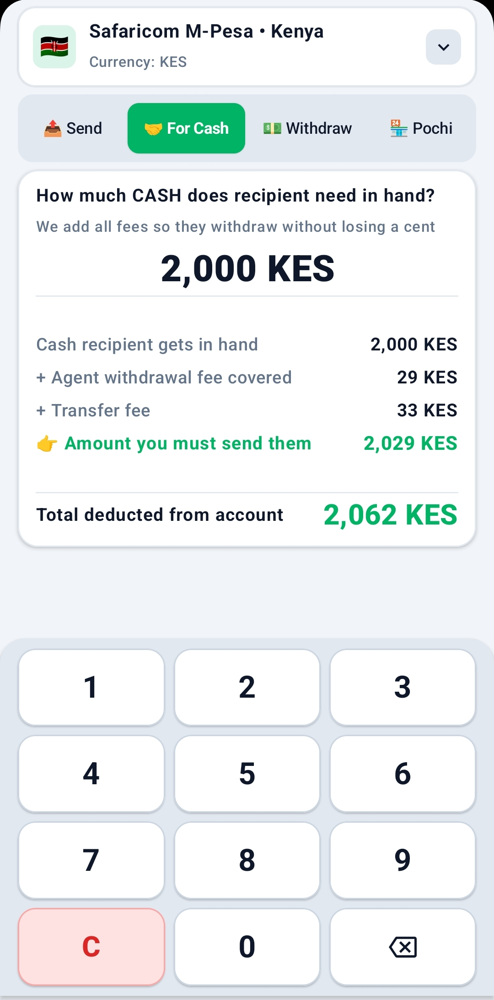
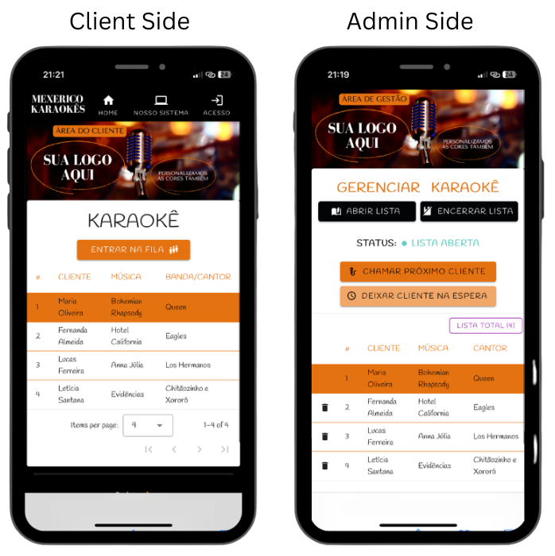

# Hey there, I'm Felipe Laurindo 👋

### Mobile (Android) & Front-End Developer · UI/UX Focused · Building Polished Products

  

## About Me

I'm a **Mobile (Android) & Front-End Developer** based in **João Pessoa, Brazil** 🇧🇷 specializing in the intersection of **human-centered UI/UX design** and **solid engineering**. I don't just build interfaces — I ship software that feels alive, runs resiliently under real-world constraints, and solves genuine user problems.

- **Real-World Track Record:** Published native Android applications live on the **Google Play Store** and shipped web software with **paying commercial clients**
- **Native Android Engineering:** High-performance apps built with **Kotlin 2.0+**, **Jetpack Compose**, and **Material 3**
- **Reactive Web Front-End:** Fluid, component-driven web applications crafted with **Vue.js 3** and **Vuetify**
- **Architecture & Systems:** Deep focus on **MVVM**, **Coroutines & Flow**, **WebSockets**, and **Offline-First** systems
- Open to **international remote opportunities**

## Tech Stack

| Domain | Technologies & Tools |
|:---|:---|
| **Mobile (Android)** |      |
| **Web & Front-End** |      |
| **Cloud & Backend** |     |
| **Design & Workflow** |    |

 

## Featured Projects

---

### 01 · [Mamão com Açúcar](https://github.com/felipematheuslo/mamao-com-acucar-android) &nbsp;  &nbsp;  &nbsp; 

> A community-driven urban mapping mobile application designed with a focus on UI/UX engineering, real-time synchronization, and local food sustainability — **published on Google Play.**

<table>
  <tr>
    <td width="30%" align="center" valign="middle">
      
    </td>
    <td width="70%" valign="top">

**The Problem:** Public spaces in Brazilian cities are filled with fruit trees, but their harvests frequently go ungathered or wasted due to a lack of visibility and real-time tracking.

**The Solution:** A community-driven mobile platform where citizens register tree coordinates, track fruiting stages in real time (blooming, green, ripe, or out of season), and share crowdsourced updates.

**Key Highlights:**
- **Live on Google Play** — production-grade release published and available on the [Google Play Store](https://play.google.com/store/apps/details?id=com.felipelaurindo.mamaocomacucar)
- **Product Evolution** — prototyped in React/Vite and re-engineered natively in Kotlin 2.0+ and Jetpack Compose
- **High-Performance Vector Map** — OSMDroid vector engine with disk tile cache & outdoor high-contrast themes (Esri Topo / Satellite)
- **Native Botanical Guide** — comprehensive in-app catalog of 68 fruit tree species with curated vector icons and botanical metadata
- **Proximity Discovery** — real-time tree sorting relative to live GPS coordinates using geodesic formulas (Haversine)
- **Real-time Sync & Auth** — Cloud Firestore live updates and secure authentication with modern Google Credential Manager
- **Outdoor UI/UX & Gamification** — Material 3 edge-to-edge layout and contributor ranks (*Sementinha* to *Mestre Frutífero*)

</td>
  </tr>
</table>

**Tech:**

 

---

### 02 · [Mobile Money Calculator](https://github.com/felipematheuslo/mobile-money-calc-android) &nbsp;  &nbsp;  &nbsp; 

> A high-performance, 100% offline financial utility app built for East African mobile money networks (Kenya & Uganda), eliminating mental math errors and transaction fee disputes — **published on Google Play.**

<table>
  <tr>
    <td width="30%" align="center" valign="middle">
      
    </td>
    <td width="70%" valign="top">

**The Problem:** Millions across East Africa rely on mobile money (M-Pesa, MTN MoMo, Airtel), but complex multi-tier tariffs, agent withdrawal fees, and statutory taxes (e.g., 0.5% in Uganda) lead to counter arguments and costly shortfalls during transactions.

**The Solution:** A zero-latency, 100% offline Android utility that solves the "Send for Cash" equation instantly — calculating the exact send subtotal, provider transfer fee, and agent withdrawal fee so the recipient withdraws the exact cash needed with zero friction.

**Key Highlights:**
- **Live on Google Play** — production-grade release published and available on the [Google Play Store](https://play.google.com/store/apps/details?id=com.felipelaurindo.mobilemoneycalc)
- **"Send for Cash" Reverse Math** — proprietary reverse-tier calculation engine covering both send fees and recipient withdrawal charges
- **Multi-Carrier Offline Engine** — instant calculations for Safaricom M-Pesa (Kenya), MTN Mobile Money, and Airtel Money (Uganda) with statutory tax integration
- **Ultra-Low-End Device Optimization** — built for 1GB–3GB RAM devices (Android Go) with <100ms cold start and 0 KB external graphics assets
- **Ergonomic Custom Numpad** — full-width large-button keypad designed for fast, one-handed operation without OS keyboard latency
- **Dynamic Brand-Reactive Theming** — interface dynamically shifts color identity per carrier (Safaricom Green, MTN Yellow, Airtel Red)
- **Smart Digital Receipt** — real-time breakdown with animated line items and zero Cumulative Layout Shift (CLS) AdMob placement

</td>
  </tr>
</table>

**Tech:**

 

---

### 03 · [Karaoke Queue Manager](https://github.com/felipematheuslo/karaoke-queue-manager) &nbsp;  &nbsp;  &nbsp; 

> A real-time B2B queue management web app for entertainment venues — **field-tested, commercially validated, and operated with paying clients.**

<table>
  <tr>
    <td width="35%" align="center" valign="middle">
      
    </td>
    <td width="65%" valign="top">

**The Problem:** Karaoke nights in entertainment venues are notoriously chaotic — paper slips get lost, physical spreadsheets cause bottlenecks, and patrons have zero visibility into their real-time stage queue position.

**The Solution:** A mobile-first, real-time web platform where patrons join the queue instantly from their smartphones with zero-login onboarding, while KJs and venue managers operate a protected real-time dashboard powered by WebSockets.

**Key Highlights:**
- **Commercial Track Record** — successfully sold and operated as a B2B product with paying entertainment venue clients
- **Dual Client & Admin Architecture** — distinct experiences: instant patron signup alongside a 1-click KJ control console
- **Real-Time WebSocket Sync** — sub-second updates powered by Firebase Realtime Database with live queue state locking
- **Live Session Counters** — thread-safe tracking of total, called, and removed singers per night using Firebase atomic increments
- **Multi-Page Architecture (MPA)** — code-split bundles separating client and admin contexts for optimized mobile load times
- **Low-Light UI/UX** — dark mode design system built with Vuetify 3 / Material Design for optimal readability in bar environments

</td>
  </tr>
</table>

**Tech:**

 

---

## What I Bring to a Team

| Strength | Description |
|:---------|:------------|
| **Full Lifecycle Ownership** | From user research and Figma prototyping to Google Play publishing and B2B commercial delivery. |
| **Mobile & Web Craftsmanship** | Deep native Android execution (Kotlin, Jetpack Compose) paired with modern reactive web architectures (Vue.js). |
| **Real-Time & Offline Systems** | Hands-on experience with WebSocket architectures, offline-first data synchronization, and optimistic UI patterns. |
| **UI/UX Engineering** | Every pixel matters. High-contrast readability, thumb-friendly ergonomics, edge-to-edge layouts, and micro-interactions. |

 

### Let's Build Something Great Together 🤝

I'm actively exploring new opportunities, international remote roles, and innovative collaborations in **Mobile (Android)** and **Front-End** engineering.

  

If you appreciate my work, feel free to leave a star ⭐ on the repositories!

